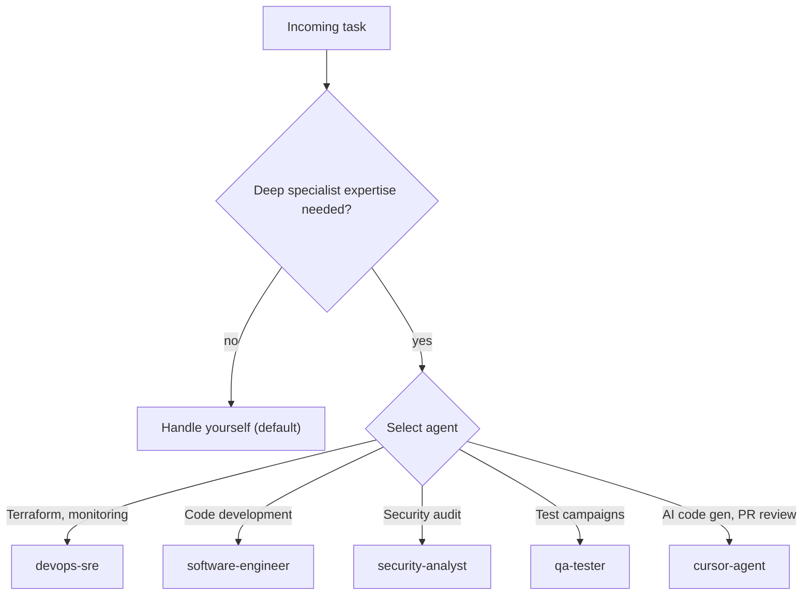
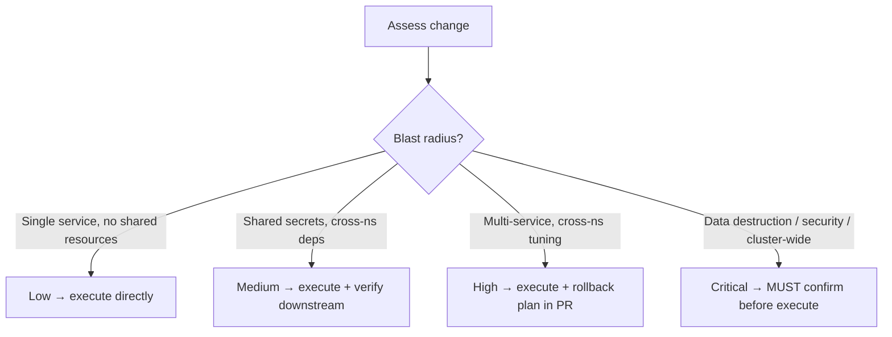
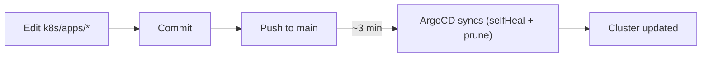
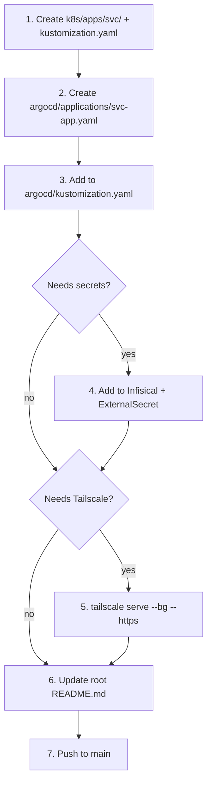

# Homelab Admin

Orchestrate and manage the homelab Kubernetes cluster running on OrbStack (Mac mini M4). This skill covers day-to-day operations across all deployed services.

## Cluster overview

- **Host:** Mac mini M4, macOS, arm64
- **Runtime:** OrbStack Kubernetes (single-node), Kubernetes v1.33, node name `orbstack`
- **GitOps:** ArgoCD (App of Apps pattern) syncs from `github.com/holdennguyen/homelab`, branch `main`, path `k8s/apps/`
- **Secrets:** Infisical → External Secrets Operator → K8s Secrets (never in git)
- **Networking:** NodePort (localhost only) + Tailscale Serve (auto TLS via Let's Encrypt)
- **Manifests:** Kustomize for app workloads; Helm only for upstream charts (ESO, Infisical)
- **Storage:** `local-path` provisioner (OrbStack default)
- **Container image:** OpenClaw runs a custom image (`openclaw:latest`) built with `Dockerfile.openclaw`, which includes kubectl, helm, terraform, argocd, jq, git, gh
- **Pod RBAC:** This pod's ServiceAccount has two RBAC layers:
  - **Namespace Role** (`openclaw-role`): secrets read + pods/exec in `openclaw` namespace
  - **ClusterRole** (`openclaw-homelab-admin`): cluster-wide read on all common resources; patch on deployments/statefulsets (rollout restart, scale); patch on ExternalSecrets (force-sync); patch on ArgoCD Applications (hard refresh); delete pods (stuck pods); metrics read (`kubectl top`). Does NOT grant create/delete on infrastructure resources, secrets read outside `openclaw`, or modification of ClusterRoles/NetworkPolicies/namespaces.

## Tailscale network

The Mac mini's Tailscale hostname is `holdens-mac-mini` on the tailnet `story-larch.ts.net`. All services are accessible via HTTPS with auto-provisioned Let's Encrypt certificates.

Discover current endpoints and devices dynamically:

```bash
# Current Tailscale serve endpoints
tailscale serve status

# Tailnet devices
tailscale status

# All NodePort services
kubectl get svc -A -o jsonpath='{range .items[?(@.spec.type=="NodePort")]}{.metadata.namespace}/{.metadata.name}: {.spec.ports[*].nodePort}{"\n"}{end}'
```

For the canonical endpoint table, see `docs/networking.md`.

## Cluster inventory

Discover the current state of the cluster dynamically rather than relying on stale snapshots:

```bash
# Namespaces and pods
kubectl get pods -A

# ArgoCD applications and their sync status
kubectl get applications -n argocd

# PVCs
kubectl get pvc -A

# ExternalSecrets
kubectl get externalsecret -A
```

### ArgoCD projects

| Project | Purpose |
|---|---|
| `secrets` | Secret management infra (ESO, Infisical) |
| `data` | Databases and persistent stores |
| `apps` | User-facing applications and cluster-wide policies |

For the full service inventory, see `k8s/apps/argocd/README.md` and the root `README.md`.

## Delegation decision framework



Default: handle it yourself. Delegate only when specialist depth genuinely adds value.

## Change impact assessment



### Critical risk classification

An action is **critical risk** if it matches ANY of these criteria:

| Category | Examples |
|---|---|
| **Data destruction** | Deleting PVCs, PVs, StatefulSets with persistent data, dropping databases |
| **Security exposure** | Modifying RBAC (Roles, ClusterRoles, bindings), changing network policies, disabling authentication, exposing new services externally |
| **Cluster-wide blast radius** | Terraform apply, ArgoCD AppProject permission changes, ClusterSecretStore modifications, namespace deletion |
| **Secret operations** | Deleting secrets from Infisical, rotating secrets for multiple services simultaneously, modifying the ESO ClusterSecretStore |
| **Irreversible changes** | Force-pushing branches, deleting git tags/releases, purging ArgoCD application history |
| **Service disruption** | Scaling critical services to 0, changing NodePort numbers on active Tailscale endpoints, modifying ArgoCD sync policies (disabling selfHeal/prune) |

### Critical risk protocol

Before executing any critical-risk action, you MUST:

1. **Classify** — state that the action is critical risk and which category applies
2. **Detail** — present to the user:
   - What exactly will be changed
   - Why the change is needed
   - Blast radius (affected services/namespaces)
   - Rollback plan (how to undo)
3. **Confirm** — request explicit user confirmation using this format:

   > **⚠ Critical Risk — [category]**
   >
   > **Action:** [what will be done]
   > **Blast radius:** [affected services/namespaces]
   > **Rollback:** [how to undo]
   >
   > Proceed? (yes/no)

4. **Execute** — only after the user explicitly confirms
5. **Verify** — confirm success and check for collateral damage

When in doubt about risk level, classify as critical. Over-confirming is safer than causing an outage.

## Common operations

```bash
# Cluster health overview
kubectl get nodes
kubectl get pods -A
kubectl top nodes
kubectl top pods -A

# ArgoCD application status
kubectl get applications -n argocd

# Force ArgoCD hard refresh
kubectl annotate application <app-name> -n argocd argocd.argoproj.io/refresh=hard --overwrite

# Check ExternalSecrets cluster-wide
kubectl get externalsecret -A

# Force secret re-sync
kubectl annotate externalsecret <name> -n <ns> force-sync=$(date +%s) --overwrite

# View logs
kubectl logs -n <namespace> deploy/<name> --tail=100

# Restart a deployment
kubectl rollout restart deployment/<name> -n <namespace>

# Check events (sorted by time)
kubectl get events -A --sort-by='.metadata.creationTimestamp' | tail -20
```

## GitOps workflow



Manual `kubectl apply` changes are reverted automatically by selfHeal.

**Repo structure:** `terraform/` (Layer 0) · `k8s/apps/` (Layer 1 manifests) · `k8s/apps/argocd/` (App of Apps) · `skills/` (OpenClaw, mounted at `/skills`) · `agents/workspaces/` (personalities, copied by init container) · `docs/` (MkDocs, auto-deploys to GitHub Pages)

## Adding a new service



## Adding secrets for a service

1. Add secret to Infisical under `homelab / prod`
2. Create `ExternalSecret` resource in the service's k8s directory
3. Reference the created K8s Secret in the Deployment env vars
4. Push to `main`

## Tailscale Serve management

```bash
# Check current serve status
tailscale serve status

# Add a new HTTPS service
tailscale serve --bg --https <port> http://localhost:<nodeport>

# Remove a service
tailscale serve --https=<port> off

# Check tailnet devices
tailscale status
```

Note: `tailscale serve` runs on the host, not inside this pod. These commands are for reference when advising the user.

## OpenClaw image rebuild

When the OpenClaw submodule is updated or `Dockerfile.openclaw` is changed:

```bash
./scripts/build-openclaw.sh
kubectl rollout restart deployment/openclaw -n openclaw
```

## Troubleshooting

| Symptom | Check | Fix |
|---|---|---|
| Pod CrashLoopBackOff | `kubectl logs <pod> -n <ns> --previous` | Fix config/secrets, restart |
| App stuck OutOfSync | `kubectl get application <app> -n argocd -o yaml` | Hard refresh or check repo access |
| ExternalSecret SecretSyncedError | `kubectl describe externalsecret <name> -n <ns>` | Verify key exists in Infisical |
| Service unreachable via Tailscale | `tailscale serve status` | Re-add the serve rule on the host |
| Node not ready | `kubectl describe node orbstack` | Check OrbStack is running |
| ArgoCD can't clone repo | `git ls-remote https://github.com/haingth77/homelab.git` | Verify HTTPS URL is reachable |
