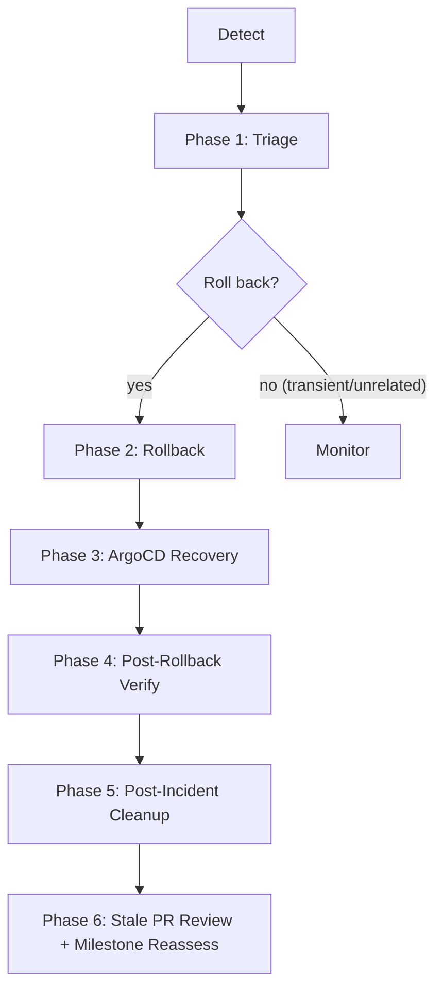
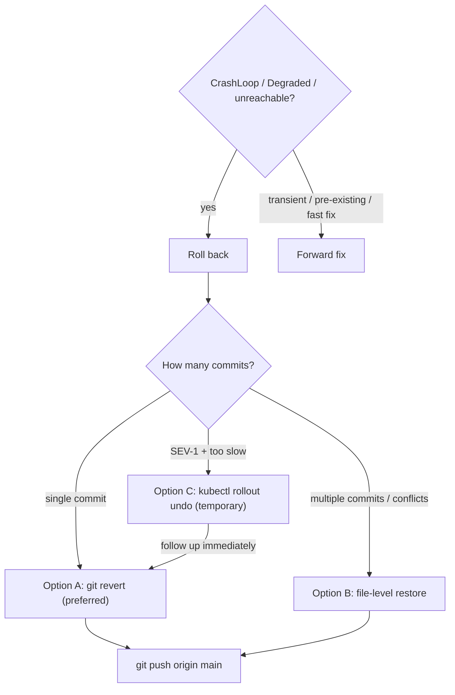
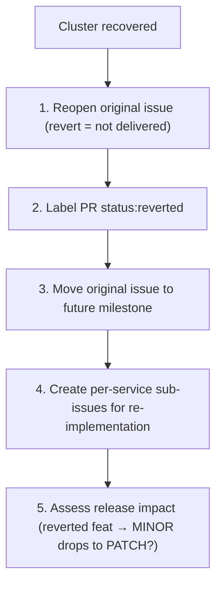
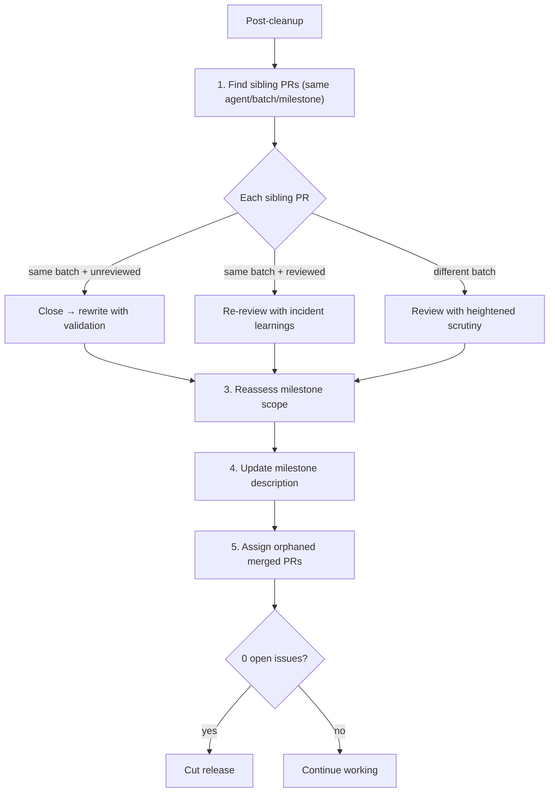

# Incident Response & Rollback

Procedures for detecting, triaging, rolling back, and documenting incidents in the GitOps-managed homelab cluster. Every agent with this skill MUST follow these procedures when a deployment causes service degradation.



## Severity Classification

| Severity | Criteria | Response Time |
|---|---|---|
| **SEV-1** | Multiple services down, data loss risk, security breach | Immediate — drop everything |
| **SEV-2** | Single service down or degraded, no data loss | Within 15 minutes |
| **SEV-3** | Non-critical service degraded, workaround exists | Within 1 hour |
| **SEV-4** | Cosmetic issue, no user impact | Next available cycle |

## Discord Alerts

When detecting incidents or cluster degradation, send alerts to the `#alerts` Discord channel via the dedicated webhook:

```bash
curl -s -X POST -H "Content-Type: application/json" "$DISCORD_WEBHOOK_ALERTS" \
  -d '{
    "embeds": [{
      "title": "⚠ Cluster Alert — SEV-N",
      "description": "**Service:** <name>\n**Status:** <CrashLoopBackOff|Degraded|...>\n**Namespace:** <ns>\n**Action:** <investigating|rolling back|resolved>",
      "color": 15158332,
      "footer": {"text": "Homelab Incident Response"}
    }]
  }'
```

Color codes: SEV-1/2 = `15158332` (red), SEV-3 = `15105570` (orange), SEV-4 = `16776960` (yellow), Resolved = `3066993` (green).

## Phase 1: Detection & Triage

When a deployment causes issues, run this triage sequence to assess blast radius:

```bash
# 1. ArgoCD application health (are any apps OutOfSync or Degraded?)
kubectl get applications -n argocd

# 2. Pod health across all namespaces
kubectl get pods -A | grep -v Running | grep -v Completed

# 3. Recent events (errors and warnings in the last 10 minutes)
kubectl get events -A --sort-by='.lastTimestamp' --field-selector type!=Normal | tail -30

# 4. Identify the failing service
kubectl describe pod <crashing-pod> -n <namespace>
kubectl logs -n <namespace> deploy/<name> --tail=100
```

**Triage checklist:**

- [ ] Which services are affected? (blast radius)
- [ ] What was the last change merged to `main`? (`git log -5 --oneline`)
- [ ] Are pods crashing (`CrashLoopBackOff`) or stuck (`Pending`/`Progressing`)?
- [ ] Is the issue caused by the new change or a pre-existing condition?
- [ ] Severity classification (SEV-1 through SEV-4)

## Phase 2: Rollback

### Rollback decision and options



**Option A (preferred):** `git revert <sha> -m 1 --no-edit && git push origin main`
**Option B (multi-commit):** `git checkout <good-sha> -- files && git commit && git push`
**Option C (SEV-1 emergency):** `kubectl rollout undo` — always follow with git revert.

## Phase 3: ArgoCD Recovery

After pushing the revert to `main`, ArgoCD should auto-sync. If it doesn't:

### Force hard refresh on all applications

```bash
for app in $(kubectl get applications -n argocd -o jsonpath='{.items[*].metadata.name}'); do
  kubectl patch application "$app" -n argocd \
    --type merge -p '{"metadata":{"annotations":{"argocd.argoproj.io/refresh":"hard"}}}'
done
```

### Stuck sync (Progressing indefinitely)

If ArgoCD is stuck waiting for a crashing pod to become healthy:

```bash
# Cancel the stuck operation
kubectl patch application <app-name> -n argocd \
  --type json -p '[{"op":"remove","path":"/operation"}]'

# Force-delete the crashing pod so the new spec can take effect
kubectl delete pod <crashing-pod> -n <namespace> --force --grace-period=0

# Trigger a fresh sync
kubectl patch application <app-name> -n argocd \
  --type merge -p '{"metadata":{"annotations":{"argocd.argoproj.io/refresh":"hard"}}}'
```

### Sync wave ordering issues

If a revert affects resources across sync waves (e.g., CRDs + CRs), sync them in order:

```bash
kubectl get application external-secrets -n argocd -o jsonpath='{.status.sync.status}'
# Wait for wave 0 to sync before checking wave 1+
```

## Phase 4: Post-Rollback Verification

Run this checklist after every rollback to confirm full recovery:

```bash
# 1. All ArgoCD applications Synced + Healthy
kubectl get applications -n argocd

# 2. All pods Running with zero recent restarts
kubectl get pods -A | grep -v Running | grep -v Completed

# 3. ExternalSecrets synced
kubectl get externalsecrets -A

# 4. Service endpoints reachable (adapt ports to your services)
# Monitoring (Grafana)
curl -sf http://localhost:30400/api/health
# Authentik
curl -sf http://localhost:30600/api/v3/root/config/
# OpenClaw
curl -sf http://localhost:30789/health

# 5. No error events in last 5 minutes
kubectl get events -A --sort-by='.lastTimestamp' --field-selector type!=Normal | tail -10
```

**Verification must pass ALL checks before the rollback is considered complete.**

## Pre-Merge Validation Checklist

Run this BEFORE merging any PR that modifies cluster resources. This prevents the need for rollbacks in the first place.

### Manifest validation

- [ ] YAML is valid (`kubectl apply --dry-run=client -f <file>`)
- [ ] Labels follow conventions (`app.kubernetes.io/*`)
- [ ] Namespace exists or `CreateNamespace=true` is set
- [ ] No secrets or credentials in the diff

### Helm chart value verification (CRITICAL)

Before changing any Helm `valuesObject` in an ArgoCD Application CR:

```bash
# 1. Verify the key exists in the chart
helm show values <repo>/<chart> --version <version> | grep -A5 "<key>"

# 2. Render templates to confirm the value takes effect
helm template <release> <repo>/<chart> --version <version> \
  --set <key>=<value> | grep -A10 "securityContext"
```

**Never assume a Helm value key exists.** Charts silently ignore unknown keys — the value appears to be set but has no effect on the rendered manifests. This was the root cause of the PR #11 incident where `controller.securityContext` (External Secrets) and `infisical.securityContext` (Infisical) were silently ignored.

### Service compatibility checks

- [ ] Container image supports the proposed configuration (e.g., non-root execution)
- [ ] Init systems (s6-overlay, tini) are compatible with securityContext changes
- [ ] Volume permissions match the proposed `fsGroup`/`runAsUser`
- [ ] Upstream chart documentation confirms the value path

### Cross-service impact

- [ ] Changes don't break sync wave dependencies
- [ ] Shared resources (ClusterRoles, CRDs) are not removed or renamed
- [ ] Existing ExternalSecrets still reference valid keys

## Post-Incident Documentation

After every incident (SEV-1 through SEV-3), document the following on the related GitHub issue or PR:

### Required sections

1. **Timeline** — chronological list of events (merge time, detection, triage, rollback, recovery)
2. **Root cause** — the specific technical cause of the failure
3. **Blast radius** — which services were affected and for how long
4. **Resolution** — what was done to restore service (revert commit SHA, manual steps)
5. **Lessons learned** — what could have prevented this (e.g., pre-merge validation, better testing)
6. **Action items** — concrete follow-up tasks with owners

### Template

```markdown
## Post-Incident Report

**Severity:** SEV-<N>
**Duration:** <start> — <end> (<minutes> min)
**Affected services:** <list>

### Timeline
| Time | Event |
|---|---|
| HH:MM | PR #N merged to main |
| HH:MM | ArgoCD sync triggered |
| HH:MM | <service> entered CrashLoopBackOff |
| HH:MM | Root cause identified |
| HH:MM | Revert pushed to main |
| HH:MM | All services recovered |

### Root Cause
<technical explanation>

### Resolution
<revert commit, manual steps>

### Lessons Learned
- <what we'd do differently>

### Action Items
- [ ] <follow-up task> — owner: <agent/user>
```

## Phase 5: Post-Incident Cleanup



**Key actions:**

- `gh issue reopen` + comment explaining revert
- `gh pr edit --add-label status:reverted` (excluded from changelog)
- Original issue → future milestone; reverted PR stays in original milestone
- Break re-implementation into per-service sub-issues with pre-merge checklists
- If reverted PR was only `type:feat`, version bump may drop from MINOR to PATCH

## Phase 6: Stale PR Review & Milestone Reassessment



**Milestone reassessment rules:**

- All features reverted/deferred → rescope to what shipped
- Only `status:reverted` feats → MINOR drops to PATCH
- Unreviewed same-batch PRs → close, move parents to next milestone

### Summary checklist (full post-incident)

- [ ] Original issue reopened with revert explanation
- [ ] Reverted PR labeled `status:reverted`
- [ ] Original issue assigned to future milestone
- [ ] Per-service sub-issues created for re-implementation
- [ ] Post-incident report posted on the reverted PR
- [ ] Sibling PRs triaged — unreviewed ones from same batch closed
- [ ] Parent issues of closed sibling PRs moved to future milestone
- [ ] Orphaned merged PRs assigned to milestones
- [ ] Milestone description updated to reflect new scope
- [ ] Release cut if milestone is ready (0 open issues)

## Troubleshooting

| Symptom | Cause | Fix |
|---|---|---|
| `git revert` has conflicts | Multiple overlapping changes | Use file-level restore (Option B) instead |
| ArgoCD stuck `Progressing` | Waiting for crashing pod health check | Cancel operation + force-delete pod (see Phase 3) |
| Revert pushed but ArgoCD not syncing | Webhook or refresh delay | Force hard refresh on all applications |
| `kubectl rollout undo` reverted by ArgoCD | Expected — ArgoCD enforces git state | Push the git revert ASAP; kubectl undo is only a temporary bridge |
| Helm values silently ignored | Invalid key path in `valuesObject` | Always verify keys with `helm show values` before PRs |
| Container crashes after `securityContext` change | Image requires root (e.g., s6-overlay init) | Check image docs; some images drop privileges internally and must start as root |
| `fsGroup` warning on OrbStack volumes | OrbStack local-path provisioner uses GID 0 | Acceptable warning; doesn't affect functionality unless the app checks GID |
