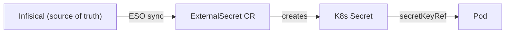
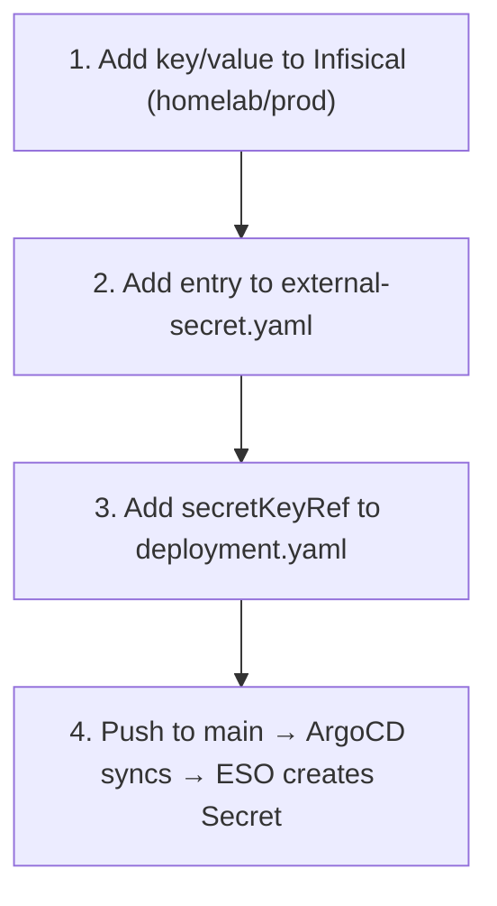
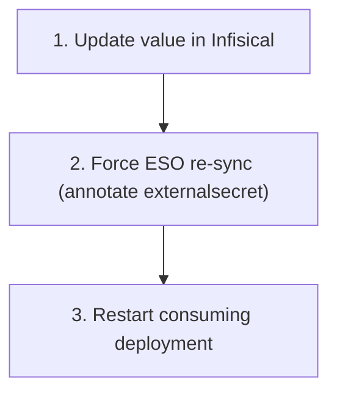

# Secret Management



Secrets never live in git.

## Adding a secret for a service



## Rotating a secret



## Checking secret health

```bash
# ClusterSecretStore connectivity
kubectl get clustersecretstore infisical
kubectl describe clustersecretstore infisical

# All ExternalSecrets across the cluster
kubectl get externalsecret -A

# Decode a secret value
kubectl get secret <name> -n <ns> -o jsonpath='{.data.<KEY>}' | base64 -d
```

## Current secrets

| ExternalSecret | Namespace | Keys |
|---|---|---|
| `authentik-secret` | `authentik` | AUTHENTIK_SECRET_KEY, AUTHENTIK_BOOTSTRAP_PASSWORD, AUTHENTIK_BOOTSTRAP_TOKEN, AUTHENTIK_POSTGRES_PASSWORD |
| `grafana-secret` | `monitoring` | GRAFANA_ADMIN_PASSWORD, GRAFANA_OAUTH_CLIENT_SECRET |
| `openclaw-secret` | `openclaw` | OPENCLAW_GATEWAY_TOKEN, OPENROUTER_API_KEY, GEMINI_API_KEY, GITHUB_TOKEN |

## Troubleshooting

| Symptom | Fix |
|---|---|
| `InvalidProviderConfig` on ClusterSecretStore | Check Infisical machine identity credentials |
| 401 Unauthorized | Update clientId/clientSecret in `terraform.tfvars`, run `terraform apply` |
| 403 Forbidden | Add machine identity to the `homelab` project in Infisical |
| ExternalSecret stuck `SecretSyncedError` | Force re-sync with annotation |
