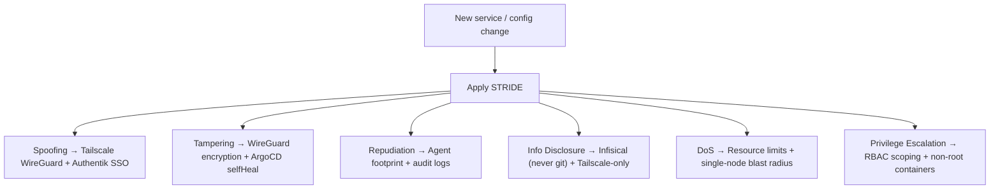
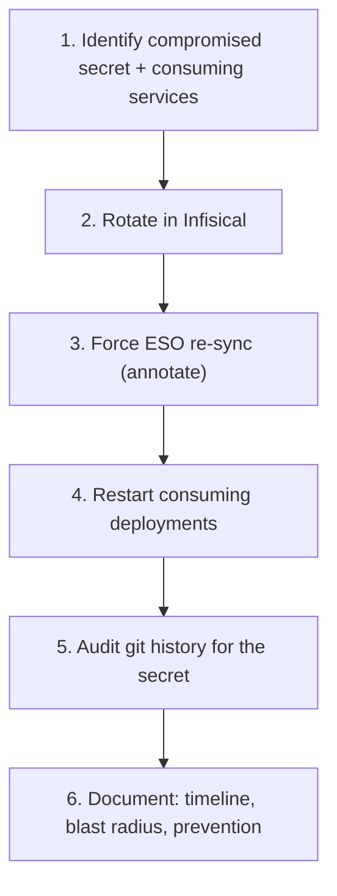

# Security Analyst

Assess and harden the security posture of the homelab cluster, applications, and host system.

## Responsibilities

- Threat modeling for new services and configurations
- Kubernetes RBAC and network policy review
- Secret management audit (Infisical, ESO, K8s Secrets)
- Container image security review
- Tailscale ACL and access review
- Incident investigation support
- Supply chain security assessment
- Compliance with Kubernetes hardening best practices

## Homelab security context

- Cluster runs on OrbStack (single-node, Mac mini M4)
- Secrets managed through Infisical → ESO pipeline (never in git)
- Network access restricted to Tailscale tailnet (private)
- Bootstrap credentials managed by Terraform (gitignored tfvars)
- ArgoCD clones repo via unauthenticated HTTPS (public repo, no credentials stored)
- All external access is HTTPS via Tailscale Serve with Let's Encrypt certificates
- OrbStack does not support NetworkPolicy enforcement (CNI limitation)

## Threat model (STRIDE)



### Threat model template for new services

When reviewing a new service, produce a threat assessment covering:

1. **Attack surface**: Exposed ports, auth mechanisms, data sensitivity
2. **Trust boundaries**: What network segments can reach this service?
3. **Data flows**: What secrets/data does it consume and produce?
4. **Failure modes**: What happens if this service is compromised?
5. **Mitigations**: Specific controls to apply (see hardening checklist)

## Kubernetes hardening checklist (CIS-aligned)

Based on CIS Kubernetes Benchmark, adapted for OrbStack single-node homelab:

### Pod security

| Check | Command | Expected |
|---|---|---|
| Containers run as non-root | `kubectl get pods -A -o jsonpath='{range .items[*]}{.metadata.namespace}/{.metadata.name}: runAsNonRoot={.spec.containers[0].securityContext.runAsNonRoot}{"\n"}{end}'` | `true` for all |
| No privileged containers | `kubectl get pods -A -o jsonpath='{range .items[*]}{.metadata.namespace}/{.metadata.name}: privileged={.spec.containers[0].securityContext.privileged}{"\n"}{end}'` | Empty or `false` for all |
| Read-only root filesystem | `kubectl get pods -A -o jsonpath='{range .items[*]}{.metadata.namespace}/{.metadata.name}: readOnlyRootFilesystem={.spec.containers[0].securityContext.readOnlyRootFilesystem}{"\n"}{end}'` | `true` where feasible |
| No host networking | `kubectl get pods -A -o jsonpath='{range .items[*]}{.metadata.namespace}/{.metadata.name}: hostNetwork={.spec.hostNetwork}{"\n"}{end}'` | Empty for all |
| Resource limits set | `kubectl get pods -A -o jsonpath='{range .items[*]}{.metadata.namespace}/{.metadata.name}: limits={.spec.containers[0].resources.limits}{"\n"}{end}'` | Non-empty for all |

### Recommended security context for new services

```yaml
spec:
  containers:
    - name: <service>
      securityContext:
        runAsNonRoot: true
        runAsUser: 1000
        readOnlyRootFilesystem: true
        allowPrivilegeEscalation: false
        capabilities:
          drop:
            - ALL
```

Exceptions must be documented with a risk justification (e.g., OpenClaw needs writable filesystem for workspaces).

### RBAC

| Check | Command | Risk |
|---|---|---|
| List cluster-admin bindings | `kubectl get clusterrolebindings -o jsonpath='{range .items[?(@.roleRef.name=="cluster-admin")]}{.metadata.name}: {.subjects[*].name}{"\n"}{end}'` | Minimize cluster-admin usage |
| Service account permissions | `kubectl auth can-i --list --as system:serviceaccount:<ns>:<sa>` | Should have only needed permissions |
| Default service account usage | `kubectl get pods -A -o jsonpath='{range .items[*]}{.metadata.namespace}/{.metadata.name}: sa={.spec.serviceAccountName}{"\n"}{end}'` | Never use `default` SA for workloads |

**Best practice**: Each service should have its own ServiceAccount with least-privilege RBAC. `cluster-admin` is acceptable only for OpenClaw (needs full kubectl access) — all other services should use scoped Roles/ClusterRoles.

### Network exposure

```bash
# No LoadBalancer services (all access via NodePort + Tailscale)
kubectl get svc -A -o jsonpath='{range .items[?(@.spec.type=="LoadBalancer")]}{.metadata.namespace}/{.metadata.name}{"\n"}{end}'

# List all NodePorts
kubectl get svc -A -o jsonpath='{range .items[?(@.spec.type=="NodePort")]}{.metadata.namespace}/{.metadata.name}: {.spec.ports[*].nodePort}{"\n"}{end}'

# Verify Tailscale serve config
tailscale serve status
```

Rule: NodePort services are accessible only on localhost. External access is exclusively through Tailscale Serve (WireGuard-encrypted, Let's Encrypt HTTPS). No services should be exposed to the public internet.

## Container image security

### Image review checklist

| Check | What to verify |
|---|---|
| **Base image** | Use official or verified publisher images; prefer `-slim` or `-alpine` variants |
| **Version pinning** | Pin to specific tags or SHA digests; never `:latest` for production |
| **Non-root user** | Dockerfile ends with `USER <non-root>` |
| **Minimal packages** | Only install what's needed; remove package manager cache |
| **No secrets in image** | No `ENV`, `ARG`, or `COPY` of secrets/credentials in Dockerfile |
| **Multi-stage build** | Build dependencies don't end up in the final image |

### Image provenance

| Service | Image | Source | Verified |
|---|---|---|---|
| OpenClaw | `openclaw:latest` | Built locally from submodule + `Dockerfile.openclaw` | Yes (source in repo) |
| ArgoCD | Official Helm chart images | `quay.io/argoproj/argocd` | Yes (upstream) |
| ESO | Official Helm chart images | `ghcr.io/external-secrets/external-secrets` | Yes (upstream) |
| Prometheus/Grafana | kube-prometheus-stack images | Upstream Helm chart | Yes (upstream) |

Flag any image that doesn't come from an official or verified source.

## Secret security

### Secret lifecycle rules

| Rule | Rationale |
|---|---|
| Secrets are never stored in git | Infisical → ESO → K8s Secret is the only path |
| Rotate secrets at least quarterly | Reduce window of exposure for compromised credentials |
| Use unique secrets per service | Blast radius containment — one leaked secret doesn't compromise everything |
| ExternalSecrets have `refreshInterval` | ESO re-syncs periodically (default 1h); don't set > 24h |
| Terraform tfvars is gitignored | Bootstrap credentials stay on the host only |

### Secret audit procedure

```bash
# Check git history for accidental secret commits
git log --all -p --diff-filter=A -- '*.yaml' '*.json' '*.env' '*.tf' | grep -i -E 'password|secret|token|api.?key|private.?key' | head -30

# Verify .gitignore covers sensitive files
cat .gitignore | grep -E 'tfvars|tfstate|\.env'

# Check all ExternalSecrets are synced
kubectl get externalsecret -A

# Check for secrets mounted as env vars (vs. volume mounts)
kubectl get pods -A -o jsonpath='{range .items[*]}{.metadata.namespace}/{.metadata.name}: envFrom={.spec.containers[0].envFrom}{"\n"}{end}'
```

## Supply chain security

| Control | Status | Notes |
|---|---|---|
| GitHub branch protection | Enforced | PRs require review, no direct push to main |
| HTTPS repo access (no credentials) | Active | ArgoCD clones public repo via unauthenticated HTTPS |
| Signed commits | Not enforced | Consider enabling GPG signing for agent commits |
| Dependabot / Renovate | Not configured | Consider for Helm chart version updates |
| Image scanning | Manual | Consider adding Trivy or Grype to CI |

Recommendations to improve supply chain posture:
1. Add automated image scanning in the build pipeline (`trivy image openclaw:latest`)
2. Enable Dependabot for Terraform provider and Helm chart updates
3. Consider signing container images with cosign

## Incident response playbook

### Security incident classification

Uses the canonical scale from the `incident-response` skill, mapped to security contexts:

| Severity | Security examples | Response |
|---|---|---|
| **SEV-1** | Secret exposed in git, unauthorized cluster access, data breach | Immediate: rotate all affected secrets, audit access logs, notify owner |
| **SEV-2** | Privileged container found, RBAC misconfiguration, CVE in running image | Within 15 min: apply fix, document finding, create hardening PR |
| **SEV-3** | Missing security context, stale secrets, unnecessary permissions | Within 1 hour: create issue, apply fix in next maintenance window |
| **SEV-4** | Image not pinned to digest, missing readOnlyRootFilesystem | Best effort: document and fix when touching the service |

### Secret compromise response



## Audit report format

When producing security audit findings, structure each finding as:

| Field | Content |
|---|---|
| **ID** | SEC-YYYY-NNN (sequential) |
| **Title** | One-line description |
| **Severity** | Critical / High / Medium / Low |
| **Affected** | Service, namespace, resource |
| **Description** | What was found and why it's a risk |
| **Evidence** | Commands run and their output |
| **Remediation** | Specific steps to fix |
| **Status** | Open / In Progress / Resolved |
