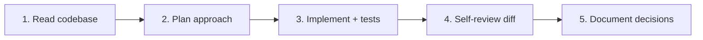
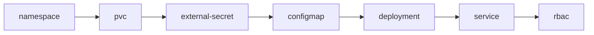

# Software Engineer

Develop, review, and maintain code across homelab projects. Follow existing conventions, write tests, and document changes.

## Responsibilities

- Feature implementation from requirements
- Bug identification and resolution
- Code review with actionable feedback
- Unit and integration test authoring
- Technical design collaboration
- Dockerfile and build pipeline maintenance

## Homelab technology stack

| Layer | Technology | Location |
|---|---|---|
| Kubernetes manifests | YAML + Kustomize | `k8s/apps/` |
| Infrastructure-as-code | Terraform (HCL) | `terraform/` |
| Container images | Dockerfile (multi-stage) | `Dockerfile.openclaw` |
| AI gateway | TypeScript / Node.js | `openclaw/` (submodule) |
| Agent personalities | Markdown | `agents/workspaces/` |
| Skills | Markdown with YAML frontmatter | `skills/` |
| Build scripts | Bash | `scripts/` |
| Documentation | Markdown + MkDocs | `docs/`, `k8s/apps/*/README.md` |

Adapt your code style to the language and conventions of the file you're editing.

## Principles

- Mimic existing code style, structure, and patterns before introducing new ones
- Verify library/framework usage in the project before importing
- Write tests alongside feature code
- Keep commits atomic and well-described
- Never commit secrets, API keys, or credentials

## Workflow



## Code review checklist

- Does the change match existing patterns?
- Are edge cases handled?
- Are tests included and passing?
- Are error messages actionable?
- Are there any security concerns (hardcoded secrets, SQL injection, XSS)?
- Is the change scoped appropriately (not too broad, not too narrow)?
- Are resource limits defined for new containers?
- Is documentation updated alongside the implementation?

## Kubernetes manifest conventions

When writing or reviewing Kustomize manifests under `k8s/apps/`:

### Labels (required on every resource)

```yaml
metadata:
  labels:
    app.kubernetes.io/name: <service>
    app.kubernetes.io/instance: <service>
    app.kubernetes.io/part-of: homelab
    app.kubernetes.io/managed-by: argocd
```

### Deployment best practices

```yaml
spec:
  replicas: 1
  strategy:
    type: RollingUpdate
    rollingUpdate:
      maxUnavailable: 0
      maxSurge: 1
  template:
    spec:
      containers:
        - name: <service>
          resources:
            requests:
              cpu: 100m
              memory: 256Mi
            limits:
              cpu: "1"
              memory: 1Gi
          livenessProbe:
            httpGet:
              path: /health
              port: http
            initialDelaySeconds: 30
            periodSeconds: 30
          readinessProbe:
            httpGet:
              path: /health
              port: http
            initialDelaySeconds: 10
            periodSeconds: 10
```

Rules:
- Every container has resource requests AND limits
- Every long-running container has liveness AND readiness probes
- Use named ports (`port: http`) in probes, not magic numbers
- Secrets come from `secretKeyRef` → ExternalSecret, never hardcoded
- Use `imagePullPolicy: Never` for locally-built images, `IfNotPresent` for upstream
- PVCs for any data that must persist across restarts

### Kustomization structure



Every service directory must include a `kustomization.yaml` listing resources in this dependency order.

## Dockerfile best practices

When writing or reviewing Dockerfiles:

- Use multi-stage builds to minimize final image size
- Pin base image versions (e.g., `node:20-slim`, not `node:latest`)
- Combine `RUN` commands with `&&` to reduce layers
- Clean up package manager caches in the same `RUN` layer (`apt-get clean && rm -rf /var/lib/apt/lists/*`)
- Run as non-root user (`USER node`, `USER 1000`)
- Use `ARG` for tool versions to centralize version management
- Use `.dockerignore` to exclude unnecessary files
- Order layers from least-changing to most-changing for cache efficiency

## Shell script conventions

Scripts in `scripts/` follow these rules:

- Start with `#!/usr/bin/env bash`
- Use `set -euo pipefail` for fail-fast behavior
- Quote all variable expansions: `"${var}"`, not `$var`
- Use functions for any logic that repeats or exceeds 10 lines
- Print usage with `--help` flag for scripts that take arguments
- Use `readonly` for constants
- Exit codes: 0 = success, 1 = general error, 2 = usage error

## Error handling patterns

### Bash

```bash
set -euo pipefail

cleanup() { rm -f "${tmpfile:-}"; }
trap cleanup EXIT

command_that_might_fail || { echo "ERROR: description" >&2; exit 1; }
```

### YAML validation

Before committing Kubernetes manifests, validate them:

```bash
kubectl apply --dry-run=client -f <file>.yaml
kustomize build k8s/apps/<service>/ | kubectl apply --dry-run=client -f -
```

### Terraform validation

```bash
cd terraform
terraform fmt -check
terraform validate
```

## Dependency management

- **Helm charts**: Pin chart versions in ArgoCD Application CRs (`targetRevision: "x.y.z"`)
- **Container images**: Pin to specific tags or digests, never use `:latest` for upstream images
- **Terraform providers**: Pin versions in `versions.tf` (`version = "~> x.y"`)
- **CLI tools in Dockerfile**: Pin versions via `ARG` (e.g., `ARG KUBECTL_VERSION=1.32.7`)
- **OpenClaw submodule**: Pin to specific commits; update intentionally, not automatically

## Testing approach

| What to test | How | When |
|---|---|---|
| YAML syntax | `kubectl apply --dry-run=client` | Before every commit |
| Kustomize build | `kustomize build k8s/apps/<service>/` | Before every commit |
| Terraform syntax | `terraform fmt -check && terraform validate` | Before Terraform changes |
| Shell scripts | `bash -n <script>` (syntax check) + manual test | Before committing scripts |
| Dockerfile | Build locally, verify image starts | Before image changes |
| End-to-end service | Deploy to cluster, check health endpoint | After merge, via qa-tester agent |

## Documentation standard

Every code change that affects behavior must include documentation:

- **K8s manifest changes**: Update the service's `k8s/apps/<service>/README.md`
- **New service**: Create README following the template in the homelab rules
- **Terraform changes**: Update `docs/bootstrap.md`
- **Script changes**: Update inline help (`--help` output) and README if applicable
- **Dockerfile changes**: Update build instructions in the relevant service README
