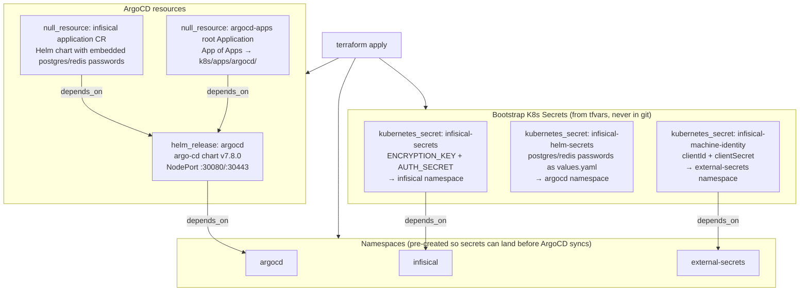

# Terraform — Bootstrap Layer

This directory contains the Terraform configuration that bootstraps the homelab cluster. It runs **once** to install ArgoCD and create all initial Kubernetes Secrets. After that, ArgoCD takes over GitOps management — including security enforcement (non-root execution, Pod Security Standards, network policies), which is managed per-service in `k8s/apps/` rather than at the Terraform bootstrap layer.

**Last reviewed:** March 8, 2025 — documentation is up-to-date with current Terraform outputs and variables.

## What Terraform Manages



## Files

| File | Purpose |
|---|---|
| `providers.tf` | Configures `kubernetes`, `helm`, `local`, and `null` providers pointing to the `orbstack` kubeconfig context |
| `argocd.tf` | ArgoCD Helm release, Infisical Application CR, root App of Apps |
| `bootstrap-secrets.tf` | Namespaces and the three bootstrap K8s Secrets |
| `variables.tf` | All variable declarations with descriptions and types |
| `outputs.tf` | Post-apply instructions, Tailscale Serve commands, and access URLs |
| `terraform.tfvars` | **Gitignored.** Actual sensitive values — copy from `terraform.tfvars.example` |
| `terraform.tfvars.example` | Template showing all required variables with placeholder values |
| `.terraform.lock.hcl` | Provider version lock file — committed to git |

## Variables

All variables are documented in `variables.tf`. The table below provides the complete reference:

| Variable | Type | Sensitive | Default | Description |
|---|---|---|---|---|
| `kube_context` | string | no | `"orbstack"` | kubeconfig context name |
| `argocd_version` | string | no | `"7.8.0"` | ArgoCD Helm chart version |
| `homelab_repo_url` | string | no | `"https://github.com/holdennguyen/homelab.git"` | HTTPS URL of the homelab git repo |
| `argocd_oidc_client_secret` | string | **yes** | — | OIDC client secret for ArgoCD's Authentik SSO provider |
| `infisical_encryption_key` | string | **yes** | — | 32-char hex string; Infisical encrypts all stored secrets with this |
| `infisical_auth_secret` | string | **yes** | — | Base64 string; Infisical JWT signing secret |
| `infisical_postgres_password` | string | **yes** | — | Password for Infisical's internal PostgreSQL |
| `infisical_redis_password` | string | **yes** | — | Password for Infisical's internal Redis |
| `infisical_machine_identity_client_id` | string | **yes** | — | Infisical Machine Identity client ID for ESO |
| `infisical_machine_identity_client_secret` | string | **yes** | — | Infisical Machine Identity client secret for ESO |

### Generating Secret Values

```bash
# infisical_encryption_key
openssl rand -hex 16

# infisical_auth_secret
openssl rand -base64 32

# infisical_postgres_password / infisical_redis_password
openssl rand -hex 12
```

## Day-1 Bootstrap

```bash
cd terraform

# 1. Copy and populate the tfvars file
cp terraform.tfvars.example terraform.tfvars
# edit terraform.tfvars with all values

# 2. Initialize providers
terraform init

# 3. Preview the plan
terraform plan

# 4. Apply
terraform apply
```

See [docs/bootstrap.md](../docs/bootstrap.md) for the complete step-by-step guide.

## Day-2 Operations

### Upgrade ArgoCD

1. Check available versions: `helm search repo argo/argo-cd --versions`
2. Update `argocd_version` in `terraform.tfvars` (or `variables.tf` default)
3. `terraform apply` — Helm performs a rolling update

### Rotate the ESO Machine Identity

1. In Infisical: **Settings → Machine Identities → homelab-eso** → generate new credentials
2. Update `terraform.tfvars`:
   ```hcl
   infisical_machine_identity_client_id     = "<new-id>"
   infisical_machine_identity_client_secret = "<new-secret>"
   ```
3. `terraform apply` — updates only the `infisical-machine-identity` K8s Secret

### Rotate the ArgoCD OIDC Client Secret

1. Generate a new client secret in Authentik (UI or API) for the `argocd` provider.
2. Update `terraform/terraform.tfvars`:
   ```hcl
   argocd_oidc_client_secret = "<new-secret>"
   ```
3. `terraform apply` — Helm updates `argocd-secret` with the new OIDC secret. ArgoCD picks it up on the next login (no pod restart needed).

### Rotate Infisical Bootstrap Secrets

> Only do this if credentials are compromised. Changing `infisical_encryption_key` requires a database migration.

1. Follow the [Infisical key rotation guide](https://infisical.com/docs/self-hosting/configuration/envars)
2. Update `terraform.tfvars` with new values
3. `terraform apply`
4. Restart Infisical: `kubectl rollout restart deployment -n infisical -l app.kubernetes.io/component=infisical`

## Why `null_resource` + `local-exec` for Application CRs

The `kubernetes_manifest` resource validates resource schemas against the live cluster API at `plan` time. ArgoCD Application CRDs do not exist until _after_ the `helm_release` runs. This creates a chicken-and-egg problem:

- `terraform plan` → tries to validate `Application` schema → CRD not found → error

The workaround:
1. `local_file` renders the Application YAML to a temporary file (`.argocd-root-app.yaml`, `.infisical-app.yaml`)
2. `null_resource` with `local-exec` runs `kubectl apply --server-side -f <file>` as a provisioner _after_ the Helm release

These temp files are gitignored. They are regenerated on every `terraform apply`.

## State Management

`terraform.tfstate` is stored **locally** (`terraform/terraform.tfstate`). It is gitignored and must be kept safe — it contains references to all managed resources and sensitive output values.

If you move to a different machine:

```bash
# Copy the state file to the new machine
scp old-machine:~/homelab/terraform/terraform.tfstate ~/homelab/terraform/

# Copy terraform.tfvars
scp old-machine:~/homelab/terraform/terraform.tfvars ~/homelab/terraform/

# Re-initialize providers
cd ~/homelab/terraform && terraform init
```

There is no remote state backend configured. For a single-person homelab, local state is sufficient.

## Troubleshooting

### `terraform apply` fails on `helm_release.argocd` (cannot patch Deployment)

If `helm list -n argocd` shows `STATUS: failed` and `helm status argocd -n argocd` shows:

```text
Upgrade "argocd" failed: cannot patch "argocd-applicationset-controller" with kind Deployment: "" is invalid: patch: Invalid value: ...
```

this is usually a Helm/Kubernetes patch conflict (e.g. managedFields or read-only fields). Fix by letting Helm recreate the Deployment:

1. **Delete the failing Deployment** (Helm will recreate it on next apply):

   ```bash
   kubectl delete deployment argocd-applicationset-controller -n argocd
   ```

2. Re-run from repo root:

   ```bash
   cd ~/homelab/terraform && terraform apply
   ```

If the release stays in `failed` and apply still errors, reset the release and re-apply:

```bash
helm uninstall argocd -n argocd
cd ~/homelab/terraform && terraform state rm 'helm_release.argocd'
terraform apply
```
